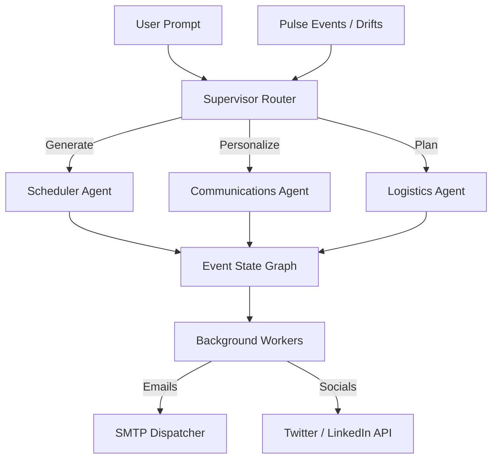

# 🌌 OrgaNexus — AI-Powered Event & Logistics Orchestrator

**OrgaNexus** is an autonomous multi-agent swarm platform designed to plan, schedule, and manage large-scale corporate and tech events. Driven by **LangGraph** & **Google Gemini**, the system transforms simple textual event drafts into full-scale logistical blueprints—including schedules, personalized emails, and press releases—while reacting dynamically to real-time anomalies (Drifts).

---

## 📐 Platform Architecture

OrgaNexus uses a **Directed Cyclic Graph (Swarm)** structure powered by LangGraph to process event state recursively.



---

## 🌟 Key Features

### 1. **Autonomous Multi-Agent planning**
*   **Supervisor Router**: Breaks down ambiguous user requests into distinct node commands.
*   **Scheduler Agent**: Assigns multi-day tracks, allocates room offsets, and enforces valid buffer margins without double-booking.
*   **Communications Agent**: Drafts segmented personalized mailing blast copies and formats schedules utilizing clean layout control intervals.
*   **Logistics Agent**: Compiles budget constraints, venue maps, and sponsor tier allocations automatically.

### 2. **Dynamic "Pulse Drift" Simulation**
If a room floods, a speaker runs late, or there's a safety emergency, you can trigger a **Pulse Drift Alert**. The Swarm iteratively reroutes affected agenda panels and fires off URGENT mailing triggers synchronized seamlessly.

### 3. **Smart Email Schedule Blast with Overrides**
*   Upload participant directories (CSV/Excel).
*   Add multiple recipient lists.
*   **Optional Custom SMTP Options**: Override global dispatch presets to send blasts from customized domains with instant Connection verification feedback loops on the upper navbars.

---

## 🛠️ Stack & Technologies

| Layer | Technologies |
| :--- | :--- |
| **Frontend** | `Next.js 14`, `React`, `Framer Motion` (Glassmorphic Animators), `TailwindCSS` |
| **Backend** | `FastAPI`, `LangGraph` (workflow cyclic nodes), `Google GenAI SDK` |
| **Utilities** | `Pandas` (CSV data processors), `Smtplib` (SMTP nodes) |
| **DevOps** | `Docker`, `Docker Compose` |

---

## 🚀 Getting Started

### 1. **Clone & Setup Environment**
Ensure you have Docker and Docker-Compose installed. Adjust `.env` weights inside the `backend` folder:

```bash
# backend/.env 
GEMINI_API_KEY_ORCHESTRATOR=your_key
GEMINI_API_KEY_SCHEDULER=your_key
GEMINI_API_KEY_COMMS=your_key
SMTP_HOST=smtp.gmail.com
SMTP_PORT=587
SMTP_USER=test@gmail.com
SMTP_PASSWORD=app_password_here
```

### 2. **Launch Containers**
To spin up both Next.js frontend and FastAPI backend nodes concurrently with watchpack polling hot-reload setups configured:

```bash
docker compose -f docker-compose.dev.yml up --build
```

You can use the **`samples/autonomous_symposium_prompt.txt`** directly into the Orchestrator panel and feed **`samples/autonomous_symposium.csv`** to the blast scheduler to test out the full recursive capability set right away!
